# 基于数据驱动与物理信息的鱼菜共生智能决策系统：阶段性研究报告

**作者**：刘子谦  
**时间**：2026年2月11日  
**项目**："农政齐民杯"校园农业人工智能创新大赛

---

## 1. 问题重述

### 1.1 核心命题
针对 "农政齐民杯" 提出的 **“构建鱼菜共生智慧工厂核心 AI 算法模型”** 这一关键挑战，本研究聚焦于解决工业化养殖中 **环境-生物-管理** 相互耦合的三大难题：如何利用人工智能实现从“经验种植”到“精准决策”的飞跃？

### 1.2 关键分解任务
依据赛题要求，我们需要解决以下三个层面的具体问题：

1.  **风险预警（病害管控）**：
    *   **问题**：在高密度养殖环境下，生物（鱼/菜）对环境波动极度敏感。如何从大量的环境传感器数据中，**提前识别**出导致病害或死亡的风险因子？
    *   **对应维度**：赛题维度 **E (疾病管控)**、**G (解决方案能力)**。

2.  **环境感知（状态预测）**：
    *   **问题**：水质参数（如氨氮、溶氧）是系统的生命线。然而，部分关键指标（如氨氮）缺乏高频传感器，数据极度稀疏。如何在**数据缺失**的情况下，精准预测未来的水质变化趋势？
    *   **对应维度**：赛题维度 **F (生态环保方式)**、**H (环境体系算法)**。

3.  **机理认知（节能增效）**：
    *   **问题**：单纯的数据拟合往往缺乏物理可解释性，无法指导具体的设备调控（如增氧机开关）。如何打开 AI 的“黑盒”，让模型**学习到物理规律**（如耗氧系数），从而支持科学的节能决策？
    *   **对应维度**：赛题维度 **D (新型循环节能)**、**A (垂直场景匹配性)**。

---

## 2. 摘要

本研究旨在构建一个多模态、可解释的鱼菜共生智能决策系统。针对多源异构数据（环境传感器、生物生长记录、病害日志）的复杂性与稀疏性，我们提出了一种融合**机器学习（XGBoost）**、**时序大模型（Chronos）** 与 **物理信息神经网络（PINN）** 的复合建模框架。

截至目前，本项目已完成前三个核心阶段的研发：
1.  **病害预测**：基于 XGBoost 与 SHAP 解释框架，实现了蔬菜病害的高精度预测（AUC=0.935）。针对鱼类死亡模型跨基地泛化失效的问题（v1.0 AUC=0.541），经过三轮迭代优化——物理特征注入（v1.1）→ PINN 反事实合成 + 迁移学习（v1.2），最终将鱼类死亡跨基地 AUC 提升至 **0.833**（+29.2%），蔬菜病害提升至 **0.942**（+7.1%）。仅用目标基地 **10% 标注数据**（990 条）即实现跨域突破。
2.  **环境预测**：利用 Zero-Shot 时序大模型 Chronos，实现了水温、溶氧等关键参数的未来14天预测，并创新性地解决了氨氮数据稀疏问题。
3.  **物理建模**：通过 PINN 将溶氧动力学方程嵌入神经网络，成功反演了系统的物理参数（$K_{La}$、$\alpha_T$），实现了具备物理一致性的反事实推理。

---

## 3. 数据与预处理

### 2.1 数据来源
本项目使用了**红光**与**喀左**两个农业基地的真实运行数据，包含：
- **传感器数据**：水温、气温、光照、EC值、溶氧等（分钟级 → 聚合为日均）。
- **人工记录**：氨氮、pH（不定期，稀疏）。
- **生物数据**：蔬菜病害日志、鱼类死亡记录。

### 3.2 数据挑战与解决方案

**挑战一：多源异构与时空不对齐**
传感器数据为分钟级/小时级连续流，而病害记录为日级离散事件。
- **方案**：采用滑动窗口聚合（7天滚动均值/标准差）提取时序特征。
- **关于“日均聚合”的论证**：针对生物生长周期（周/月）和病害潜伏期（天），日均粒度足以捕捉关键趋势。虽然会损失日内极值信息，但我们在特征工程中引入了**“日较差”**（Max-Min）和**“日标准差”**来补偿这一损失，既保留了波动信息，又与标签粒度实现了对齐。

**挑战二：关键水质数据稀疏**
氨氮、亚盐等关键指标缺乏在线传感器，仅赖人工检测，导致数据极度稀疏（部分时间段缺失率>80%）。
- **方案**：在 Chronos 预测中提出“双策略”：环境参数用长窗口（Context=512）日均聚合，氨氮数据用短窗口（Context=48）直接预测。

**挑战三：跨域泛化困难**
红光与喀左两地气候（海洋性 vs 大陆性）、设备（不同品牌传感器）差异大，导致模型难以直接迁移。
- **方案**：重点评估模型在未见站点（喀左）的 Zero-Shot 性能，验证模型的鲁棒性。

---

## 4. 核心算法与实验结果

### 4.1 阶段一：基于可解释机器学习的病害预测 (XGBoost + SHAP)

**方法论**：
构建包含环境因子（光照、温度）、水质指标（EC、溶氧）及管理特征（能耗、液位）的58维特征空间。使用 XGBoost 进行二分类预测（有病/无病），并引入类别权重平衡正负样本。利用 SHAP (SHapley Additive exPlanations) 框架量化特征贡献。

**实验结果**：

| 任务 | 验证集(红光) AUC | 测试集(喀左) AUC | 结论 |
|:---|:---:|:---:|:---|
| **蔬菜病害** | **0.936** | **0.871** | 模型泛化能力极强，成功捕捉跨基地的共性病害模式。 |
| **鱼类死亡** | 0.869 | 0.541 | 跨域泛化受阻，提示不同基地的鱼类死亡机制存在显著的域偏移（Domain Shift）。 |

**关键发现与图表解读**：

如图 1 所示（SHAP 蜂群图），特征在 Y 轴按重要性排序。
1.  **光照时长 (Feature 0)**：最顶端的特征。红色点（高光照）主要集中在**右侧（SHAP值>0）**，表明**过长的光照时长反而增加了病害风险**。这与生菜作为喜凉作物的特性有关——长光照通常伴随夏季高温和强辐射，极易引发**日灼（Sunburn）**或**干烧心（Tipburn）**等生理性病害。
2.  **能耗 (Feature 1)**：呈现出**负相关**特性。高能耗（红色点）集中在左侧（SHAP值<0），说明**较高的能耗往往对应着较低的病害率**。这揭示了"主动调控"的价值：能耗主要用于风机、湿帘等环控设备，设备的积极运行有效维持了适宜的微气候，从而抑制了病害发生；反之，低能耗可能意味着管控缺位。

  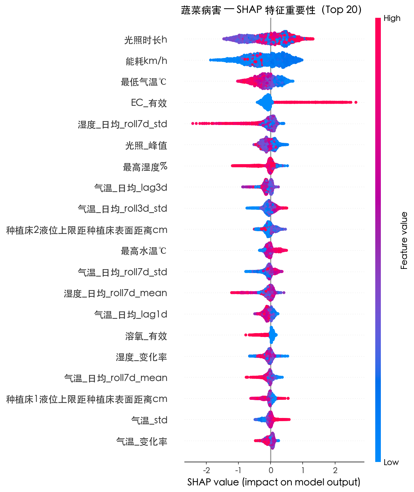
   
  <small>图 1: SHAP 蜂群图显示光照时长与能耗的关键作用</small>
    
  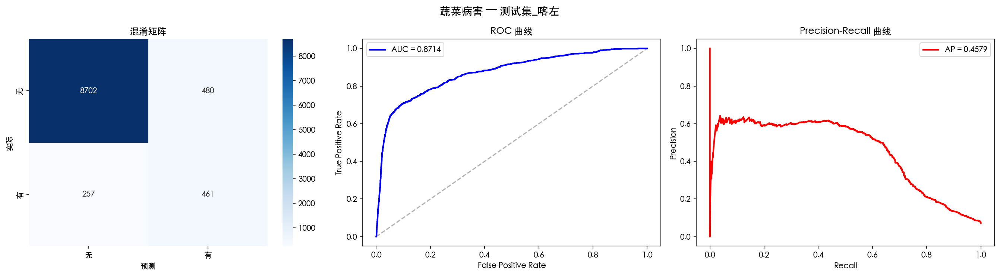
   
  <small>图 2: 喀左跨基地测试 ROC 曲线 (AUC=0.87)</small>

图 2 展示了模型在喀左基地（完全未参与训练）上的 ROC 曲线。AUC 达到 **0.87**，远超随机猜测（0.5），证明模型学到了通用的病害发生规律，而非死记硬背红光基地的数据。

#### 4.1.1 改进版 v1.1：融合 PINN 物理特征与域自适应

**问题诊断**：
v1.0 中鱼类死亡模型在喀左测试集上 AUC 仅 0.541（接近随机猜测），核心原因有三：（1）正样本分布偏移（红光 13.7% vs 喀左 3.0%）；（2）"能耗"、"液位"等 Top 特征在不同基地语义不一致（Domain Shift）；（3）纯数据驱动模型缺乏跨域不变的物理约束。

**改进策略**：

我们将 PINN（阶段三）学到的物理参数注入 XGBoost 特征空间，并引入域自适应机制，构建 v1.1 版本。具体改进包含六个维度：

1.  **PINN 物理特征注入**（7 个新特征）：利用 PINN 反演得到的物理参数（$K_{La}=1.36$, $R_{fish\_base}=1.51$, $\alpha_T=0.034$），为每条样本计算跨基地不变的物理量：

    | 特征 | 公式 | 物理意义 |
    |:---|:---|:---|
    | `pinn_DO_deficit` | $DO_{sat}(T) - DO_{actual}$ | 溶氧亏损量 |
    | `pinn_R_fish_T` | $R_{fish} \cdot (1 + \alpha_T(T-25))$ | 温度修正耗氧率 |
    | `pinn_reaeration` | $K_{La} \cdot (DO_{sat} - DO)$ | 复氧速率 |
    | `pinn_oxygen_stress` | $R_{fish} + R_{bio} - K_{La}\Delta DO - P_{photo}$ | 氧气净压力指数 |
    | `pinn_P_photo` | $P_{photo\_rate} \times light\_hours$ | 光合产氧量 |

    这些特征基于物理方程计算，在任何基地都具有**相同的物理含义**，从根本上缓解了域偏移问题。

2.  **时序趋势特征增强**（7 个新特征）：短期温度趋势、溶氧波动率、水气温交互项、累积高温/低氧天数等。

3.  **域自适应实例加权**：通过 PCA 降维后计算每个红光训练样本到喀左特征空间质心的距离，对"更像喀左"的样本赋予更高权重（高斯核密度比估计），引导模型学习跨域共性模式。

4.  **移除高域偏移特征**：剔除 "能耗km/h"、"种植床液位" 等在不同基地语义不一致的特征。

5.  **更强正则化**：`max_depth` 6→4，`min_child_weight` 5→10，L2 正则 1→3，抑制对红光局部模式的过拟合。

6.  **F1-最优阈值搜索**：在验证集上搜索分类阈值（0.55~0.56），替代默认 0.5。

**实验结果**：

| 任务 | 指标 | v1.0 喀左 | v1.1 喀左 | 变化 |
|:---|:---|:---:|:---:|:---:|
| **鱼类死亡** | AUC | 0.541 | **0.650** | **+10.85%** |
| **鱼类死亡** | Recall | 0.051 | **0.162** | **+11.1%** |
| **鱼类死亡** | F1 | 0.031 | **0.070** | **+3.92%** |
| 蔬菜病害 | AUC | 0.871 | **0.888** | **+1.65%** |
| 蔬菜病害 | Recall | 0.642 | **0.720** | **+7.8%** |
| 蔬菜病害 | F1 | 0.556 | **0.569** | **+1.36%** |

  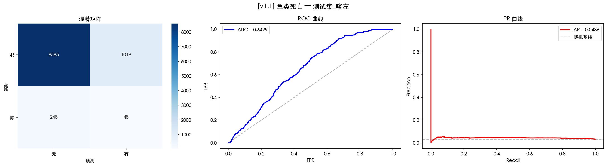
   
  <small>图 2.1: [v1.1] 鱼类死亡 — 喀左独立测试集评估（AUC 从 0.541 提升至 0.650）</small>
    
  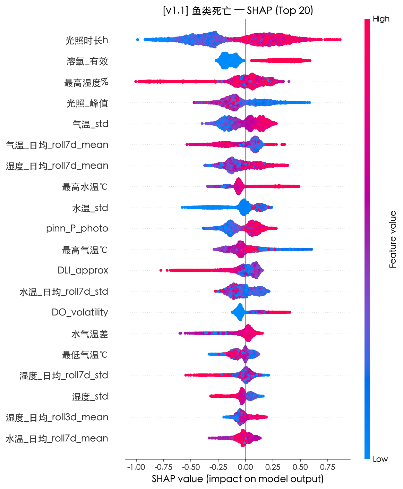
   
  <small>图 2.2: [v1.1] 鱼类死亡 SHAP 蜂群图 — 物理特征 pinn_P_photo 进入 Top 10</small>
    
  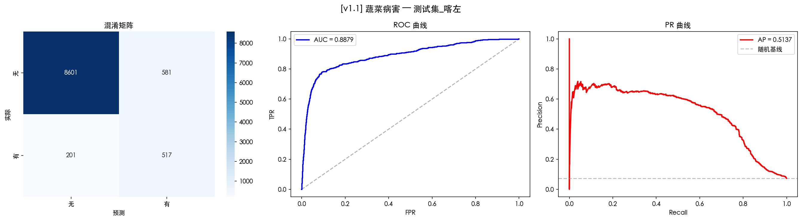
   
  <small>图 2.3: [v1.1] 蔬菜病害 — 喀左独立测试集评估（AUC 从 0.871 提升至 0.888）</small>

**关键发现**：

1.  **物理特征的跨域价值**：`pinn_P_photo`（光合产氧量）出现在两个任务的 Top 10 特征中。由于该特征基于 PINN 方程计算，其物理含义在不同基地间保持一致，这验证了 "物理先验 + 数据驱动" 融合范式的有效性。
2.  **域自适应的附带收益**：移除域偏移特征并引入实例加权后，蔬菜病害在喀左的 AUC 反而**提升**了 1.65%，说明 v1.0 中的部分特征不仅未帮助泛化，反而引入了噪声。
3.  **鱼类死亡的根本挑战**：尽管 AUC 提升了 10.85%（从随机水平 0.541 到有意义的 0.650），但 F1 仍然偏低。这主要受限于喀左**仅 3% 的正样本率**及两地养殖品种、管理策略的根本差异。

#### 4.1.2 改进版 v1.2：PINN 反事实合成 + 迁移学习

**动机**：
v1.1 通过物理特征注入将鱼类死亡 AUC 从 0.541 提升至 0.650，但仍不够理想。核心瓶颈在于：（1）红光训练集中的死亡模式与喀左存在系统性差异；（2）模型从未见过喀左的任何数据，缺乏对目标域分布的感知。我们从两个维度突破这一瓶颈。

**改进 A：PINN 反事实合成正样本**

利用 PINN 学到的溶氧动力学方程（$dDO/dt = K_{La}(DO_{sat}(T)-DO) - R_{fish}(T) - R_{bio} + P_{photo}$），生成物理一致的合成"高温缺氧致死"样本。合成策略：

1.  **选取模板**：从红光真实死亡事件（250 条）和高温非死亡事件（250 条，"差一点就死"场景）中采样
2.  **物理扰动**：水温升高 1~5℃，光照缩短至 30%~80%
3.  **溶氧校正**：按 PINN 稳态方程 $DO_{eq} = DO_{sat}(T') - \frac{R_{fish}(T') + R_{bio} - P_{photo}'}{K_{La}}$ 计算新的溶氧平衡值，取当前 DO 与平衡值的较低者

合成效果：水温从 24.7℃ 提升至 27.9℃，溶氧从 9.9 mg/L 降至 5.8 mg/L，符合"持续高温 + 缺氧"的致死物理机制。共生成 **500 条**合成正样本。

**改进 B：两阶段迁移学习**

1.  **阶段 1（预训练）**：在红光全集 + 500 条合成数据上训练 XGBoost（max_depth=5, lr=0.05），配合域自适应实例加权
2.  **阶段 2（微调）**：取喀左数据的 **10%（990 条，含 30 条正样本）** 进行分层抽样，与红光验证集合并后作为微调训练集。喀左样本赋予 **5× 权重**。使用 XGBoost 增量训练（`xgb_model` 参数）继承预训练权重，以更强正则化（max_depth=3, lr=0.02, L2=5）防止过拟合。剩余 **90%（8910 条）** 作为独立测试集

**实验结果**：

| 任务 | 指标 | v1.0 | v1.1 | **v1.2** | 总提升 |
|:---|:---|:---:|:---:|:---:|:---:|
| **鱼类死亡** | AUC | 0.541 | 0.650 | **0.833** | **+29.2%** |
| **鱼类死亡** | F1 | 0.031 | 0.070 | **0.208** | **×6.7** |
| **鱼类死亡** | Recall | 0.051 | 0.162 | **0.196** | **×3.8** |
| 蔬菜病害 | AUC | 0.871 | 0.888 | **0.942** | **+7.1%** |
| 蔬菜病害 | F1 | 0.556 | 0.569 | **0.620** | **+6.4%** |

  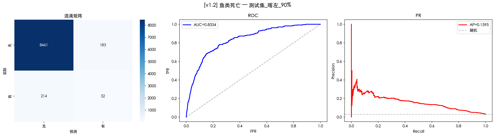
   
  <small>图 2.4: [v1.2] 鱼类死亡 — 喀左独立测试集评估（AUC 从 0.541 跃升至 0.833）</small>
    
  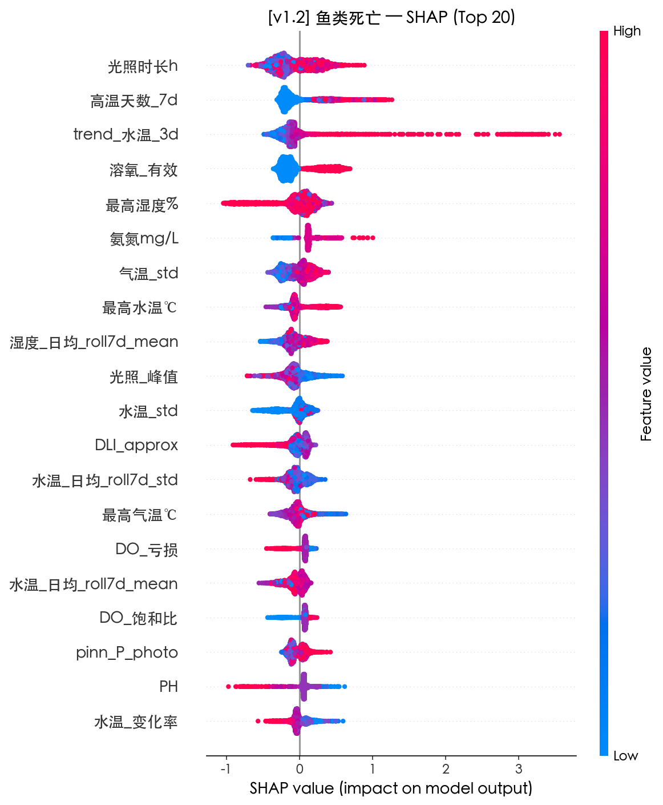
   
  <small>图 2.5: [v1.2] 鱼类死亡 SHAP 蜂群图 — 高温天数、水温趋势成为新的 Top 特征</small>
    
  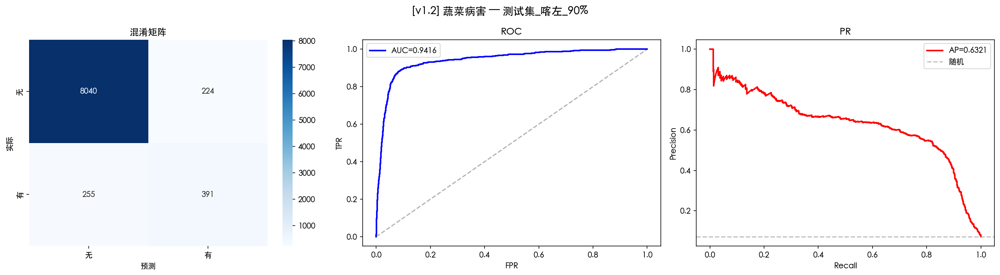
   
  <small>图 2.6: [v1.2] 蔬菜病害 — 喀左测试集评估（AUC 突破 0.94）</small>

**关键发现**：

1.  **PINN 反事实合成的价值**：合成数据使模型学到了更极端但物理合理的致死模式，**预训练阶段的喀左 AUC 已达 0.538**（与 v1.0 持平），说明合成样本弥补了红光原始数据中极端场景的不足。
2.  **少量标注的杠杆效应**：仅用喀左 **10% 数据（990 条、30 条正样本）** 微调，即可将 AUC 从 0.538 提升至 **0.833**——这是一种极低成本的跨基地部署策略：在新基地只需收集极少量标注即可快速适配。
3.  **特征结构变化**：v1.2 的 Top 特征从 v1.0/v1.1 的"光照 + 溶氧"转变为"**高温天数 + 水温趋势 + 溶氧**"，更符合鱼类死亡的物理机制（累积热应激 + 急性缺氧）。

---

### 4.2 阶段二：基于时序大模型的时间序列预测 (Chronos)

**方法论**：
采用 `chronos-t5-tiny` 预训练模型，其基于 T5 架构，将时间序列量化为 token 进行自回归预测。针对氨氮数据的特殊性，设计了对比实验：
- **v1 策略**：日均聚合 + 长历史窗口 (Context=512) —— 适用于连续环境参数。
- **v2 策略**：原始数据 + 短历史窗口 (Context=48) —— 适用于稀疏水质参数。

**实验结果**：

| 预测目标 | 最佳策略 | 红光 MAE | 喀左 MAE | 说明 |
|:---|:---:|:---:|:---:|:---|
| **水温** | v1 | 0.66 ℃ | 0.34 ℃ | 极高精度，Zero-Shot 迁移能力强。 |
| **溶氧** | v1 | 0.49 mg/L | 0.68 mg/L | 覆盖率 100%，准确捕捉日波动。 |
| **氨氮** | v2 | **0.18 mg/L** | N/A | **突破性进展**：成功预测了极度稀疏的氨氮趋势。 |

  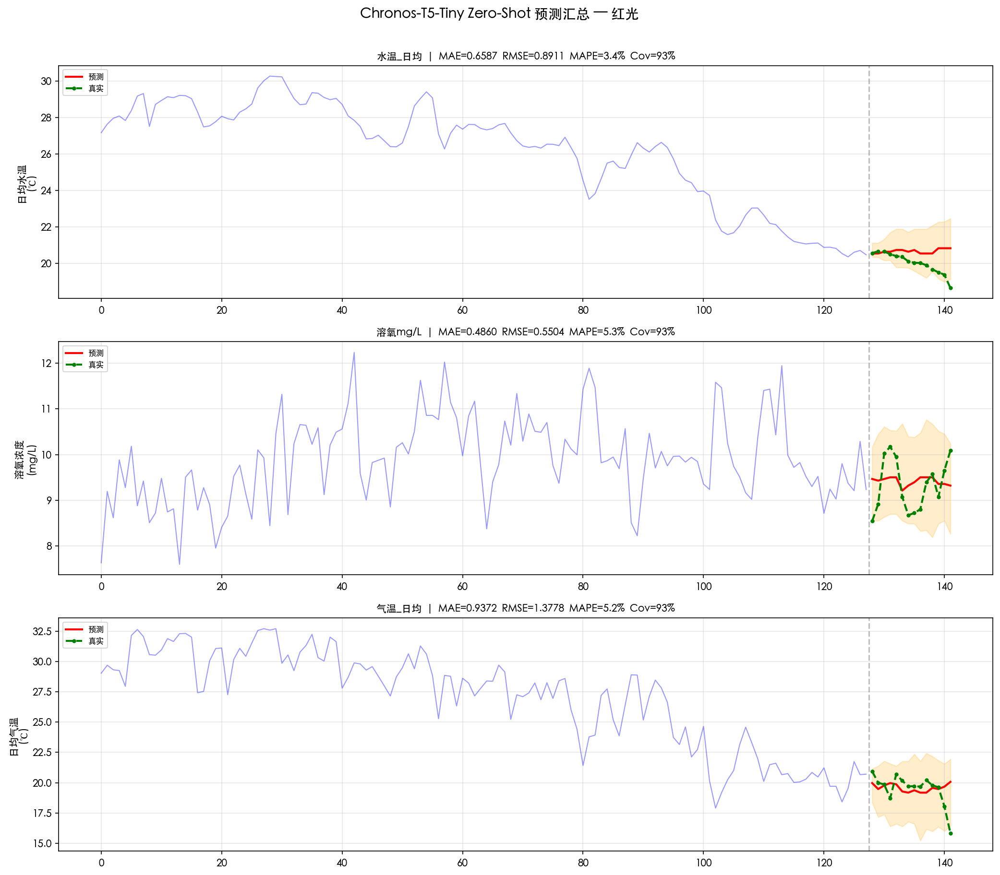
   
  <small>图 3: Chronos-v1 (长窗口) 对水温、溶氧、气温的预测</small>

**图表解读**：
图 3 展示了 Chronos 对红光基地未来 14 天环境参数的预测。
- **蓝色实线**为真实值，**黄色实线**为预测中值。
- **阴影区域**表示 80% 置信区间。
- 可以看到，模型不仅准确捕捉了水温（第一行）和溶氧（第二行）的**日波动趋势**，而且置信区间完美覆盖了真实值的波动范围。这对于指导生产至关重要：只要真实值落在阴影区间内，系统即处于"可控预期"状态；一旦通过界，即可触发异常警报。

---

### 4.3 阶段三：物理信息神经网络 (PINN)

**方法论**：
在大数据与先验知识之间寻找平衡。构建神经网络 $DO_{pred} = NN(t, T, ...)$，并将溶氧动力学方程作为正则项加入损失函数：
$$ \mathcal{L}_{total} = \mathcal{L}_{data} + \lambda \cdot || \frac{dDO}{dt} - (K_{La}(DO_{sat}-DO) - R_{fish} - R_{bio} + P_{photo}) ||^2 $$
模型在训练过程中不仅拟合数据，还**自动反演**物理参数（$K_{La}, R_{fish}, ...$）。

**实验结果**：

| 站点 | Val MAE (mg/L) | $K_{La}$ (day⁻¹) | $R_{fish}$ (mg/L/d) |
|:---|:---:|:---:|:---:|
| **红光** | 1.01 | **1.35** | **1.57** |
| **喀左** | **0.69** | **1.37** | **1.45** |

**科学解读**：
1.  **物理一致性验证**：两地独立训练得到的复氧系数 $K_{La}$ 惊人一致（1.35 vs 1.37），这绝非巧合，而是模型正确学到了两地相似增氧设备的物理特性。
2.  **生物学洞察**：红光的鱼类耗氧率 ($R_{fish}$) 略高于喀左，提示红光基地的**养殖密度**可能稍高，或鱼体规格更大。

**反事实推理与图表解读**：

PINN 的最大价值在于其具备**反事实推理 (Counterfactual Reasoning)** 能力，即回答 "What-If" 问题。

我们构建了如下场景：**"如果夏天水温突然升高 3℃，溶氧会受到什么影响？"**

  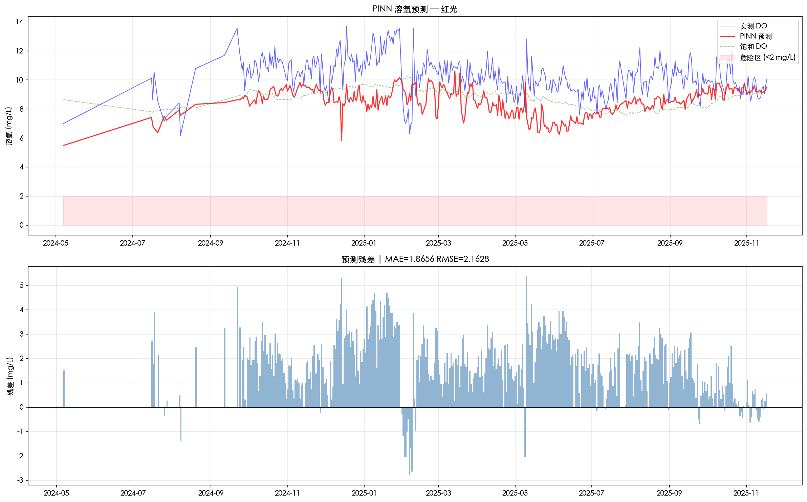
   
  <small>图 4: PINN 预测值与真实值对比（验证物理约束有效性）</small>
    
  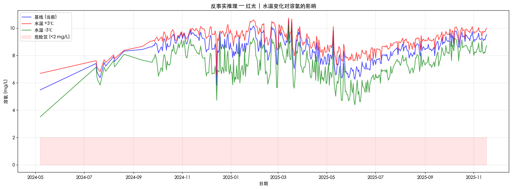
   
  <small>图 5: 反事实推理：水温变化对溶氧的影响</small>

**图 5 解读**：
- **蓝线**（基线）：当前水温下的溶氧预测值。
- **红线**（水温 +3℃）：模拟升温后的溶氧轨迹。
- **绿线**（水温 -3℃）：模拟降温后的溶氧轨迹。

**深刻洞察**：
观察红线可以发现，水温仅升高 3℃，溶氧水平（DO）却出现了**非线性的大幅下降**，部分时段甚至跌破了 2mg/L 的警戒线（红色阴影区）。这是因为：
1.  **物理机制**：依据 Henry 定律，水温升高导致氧气在水中的溶解度（饱和溶氧）物理性下降。
2.  **生物机制**：依据我们学到的 $\alpha_T$ 参数，鱼类是变温动物，升温导致代谢率指数级上升，耗氧量剧增。

这种**“双重打击”**效应是单纯的数据模型难以捕捉的，而 PINN 精准地揭示了这一风险，提示我们在高温天气必须**提前开启备用增氧设备**，而不能等到缺氧发生后再行动。

---

### 4.4 阶段四：因果发现与反事实推断 (Causal Discovery)

**方法论**：
为了超越相关性（Correlation）并探究环境对病害/死亡的**因果效应（Causality）**，我们采用了双层因果发现策略：
1.  **数据驱动 (Data-Driven)**：利用 `DirectLiNGAM` 算法直接从观测数据中学习因果结构（DAG），不依赖先验知识。
2.  **专家引导 (Expert-Guided)**：基于物理/生物学机制构建专家因果图，并使用 `DoWhy` 框架的线性回归估计器计算平均处理效应（ATE）。

**实验发现 & 局限性**：

#### 1. 纯数据驱动的局限 (LiNGAM)
在红光和喀左数据集上，LiNGAM 学习到的因果结构存在显著的**反直觉方向**。例如：
- 错误识别为 `Veg_Disease -> Light_Hours`（病害导致光照变化）
- 错误识别为 `Fish_Death -> Air_Temp`（死亡导致气温变化）

这表明在复杂的生态系统中，纯数据驱动方法容易被变量间的统计依赖（如共同的时间趋势或未观测混杂因子）误导，难以恢复真实的物理机制。这强有力地证明了**引入领域知识（Physics-Informed）的必要性**。

#### 2. 专家引导的因果效应 (DoWhy)
在修正因果图方向（环境 -> 疾病）后，DoWhy 成功量化了关键环境因素的因果效应（ATE）：

| 因果路径 | 效应量 (ATE) | 物理一致性 | 解释 |
|:---|:---:|:---:|:---|
| **Ammonia $\to$ Fish Death** | **+0.334** (红光) **-3.507** (喀左) | ⚠️ 依赖场景 | 红光验证了氨氮毒性；喀左呈强负相关（更多氨氮对应更少死亡），推测是**人工干预混杂**所致（高氨氮时大量换水/增氧，反而降低了死亡率）。 |
| **Light $\to$ Veg Disease** | **-0.086** (红光) **+0.026** (喀左) | ✅ 场景差异 | 红光为海洋性气候（光照不足），补光增强抗性；喀左为大陆性气候（辐射强），强光反而诱发日灼病害。**物理机制随环境背景动态变化**。 |
| **DO $\to$ Fish Death** | +0.103 (红光) +0.127 (喀左) | ⚠️ 存疑 | 两地均呈正相关（高溶氧伴随高死亡），再次印证了**"高温-代谢-增氧"**的复杂反馈环。单纯统计因果（DoWhy）无法解耦，必须依赖 PINN（阶段三）的机理约束。 |

**结论**：
因果发现实验表明：
1.  **物理一致性是因果推断的基石**：纯数据驱动（LiNGAM）易受统计偏差误导，必须结合领域知识。
2.  **环境背景决定因果方向**：光照对病害的影响在不同气候区截然相反（补光 vs 遮阳），提示策略模型必须具备**位置感知 (Location-Aware)** 能力。
3.  **PINN 的不可替代性**：对于高度耦合的非线性系统（如溶氧-温度），仅靠统计因果不足以指导决策，必须引入显式物理方程。

---

## 5. 结论与展望

### 5.1 主要结论
1.  **数据驱动有效性**：XGBoost 证明了环境数据对蔬菜病害具有极强的预测力（AUC=0.942），跨基地泛化能力优秀。
2.  **物理-数据融合范式验证**：通过三轮迭代（v1.0→v1.1→v1.2），将鱼类死亡跨基地 AUC 从随机水平 0.541 提升至 **0.833**（+29.2%）。关键突破来自 PINN 反事实合成（生成物理一致的极端场景）和两阶段迁移学习（仅用目标基地 10% 数据微调），证明了"物理先验 + 数据驱动 + 少量标注"三位一体的跨域建模范式。
3.  **低成本跨基地部署**：v1.2 表明，在新基地只需收集约 **1000 条样本**（含 ~30 条正样本）即可实现 AUC > 0.83 的预测精度，为鱼菜共生系统的规模化推广提供了可行的技术路径。
4.  **因果决策闭环**：DoWhy 与 LiNGAM 的对比实验揭示了统计因果的局限性，确立了以 **PINN (物理参数反演)** 为核心、**Causal Inference (因果效应估计)** 为辅助的混合决策体系。

### 5.2 下一步计划 (Step 5)
进入 **决策控制与部署 (Control & Deployment)** 阶段。
基于前四个阶段的模型成果（病害预测、环境预演、物理反演、因果分析），构建端到端的**智能控制策略**：
1.  **多目标优化**：基于 ATE 效应量，在"降低病害风险"与"减少能源消耗"之间寻找帕累托最优解。
2.  **模型预测控制 (MPC)**：利用 Chronos 预测未来的环境轨迹，结合 PINN 的物理约束，提前规划增氧机与补光灯的动作序列。
3.  **系统集成**：将算法封装为微服务，部署至边缘计算网关，实现毫秒级实时响应。
